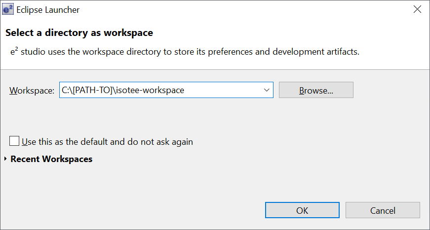
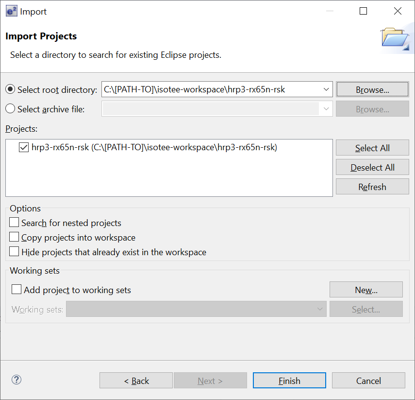
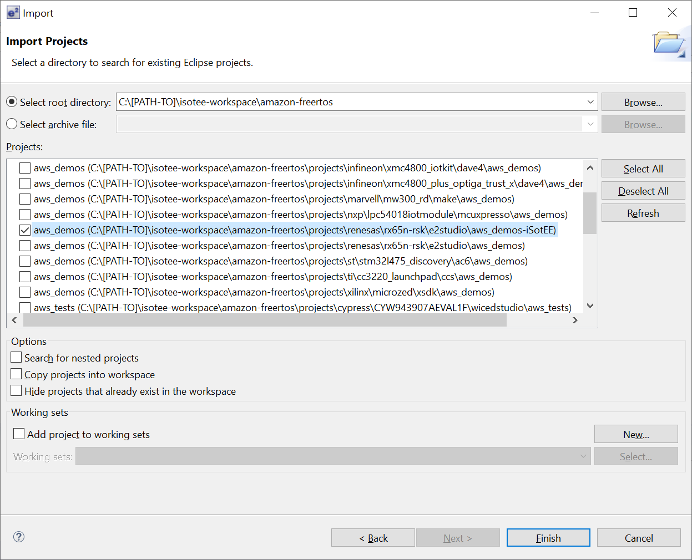
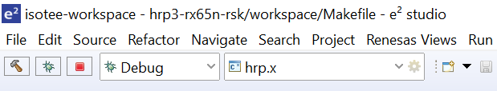

# Get Started

| Component | Tested |
| --- | --- |
| Target Board | Renesas Starter Kit+ for RX65N-2MB |
| IDE | e²studio 7.8.0 |
| Compiler | CCRX v3.01.00 |

## Step 1: Get the source code

~~~bash
mkdir isotee-workspace
cd isotee-workspace
git clone --recursive https://github.com/iSotEE/hrp3-rx65n-rsk.git
git clone --recursive https://github.com/iSotEE/amazon-freertos.git
~~~

## Step 2: Import projects

1. Start e2studio with `isotee-workspace` as the workspace

2. Import `hrp3-rx65n-rsk` and `amazon-freertos` projects from menu `File -> Import -> General -> Existing Projects into Workspace`

## Step 3: Build projects

Build `aws_demos` and `hrp3-rx65n-rsk`.

## Step 4: Start debugging

Use `hrp.x` to load host and guest images for debugging.

